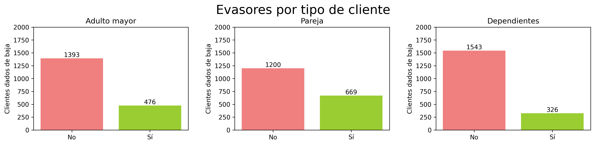
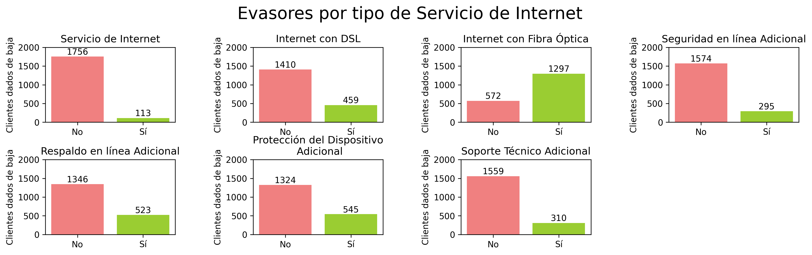
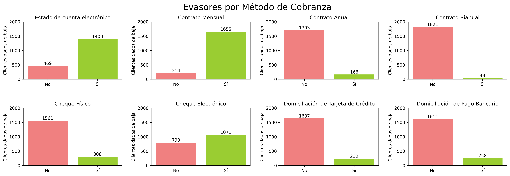
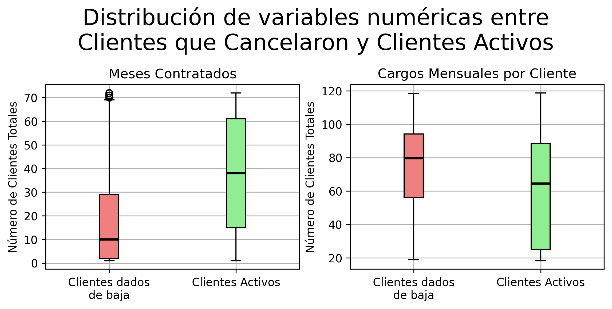

# Challenge-TelecomX_parte2
Tu nueva misión es desarrollar modelos predictivos capaces de prever qué clientes tienen mayor probabilidad de cancelar sus servicios.  La empresa quiere anticiparse al problema de la cancelación, y te corresponde a ti construir un pipeline robusto para esta etapa inicial de modelado.

📄 Abre  el archivo `TelecomX_parte2.ipynb` para visualizar el código y el informe final. 

# Cómo abrir el archivo `TelecomX_parte2.ipynb`

1. Asegúrate de tener **Python** instalado en tu computadora.
2. Instala **Jupyter Notebook** ejecutando en la terminal: `pip install notebook`
3. Abre la **terminal** (o símbolo del sistema).
4. Dirígete a la carpeta donde se encuentra el archivo `.ipynb`.
5. Ejecuta el comando: `jupyter notebook`
6. Se abrirá Jupyter en tu navegador web.
7. Haz clic sobre el archivo **.ipynb** para abrirlo.
8. Asegúrate que el archivo `datos_tratados.csv` esté en la misma carpeta que el notebook.

✅ El cuaderno quedará listo para usarse. ✨

## 📖 Diccionario de datos

- `customerID`: número de identificación único de cada cliente
- `Churn`: si el cliente dejó o no la empresa
- `gender`: género (masculino y femenino)
- `SeniorCitizen`: información sobre si un cliente tiene o no una edad igual o mayor a 65 años
- `Partner`: si el cliente tiene o no una pareja
- `Dependents`: si el cliente tiene o no dependientes
- `tenure`: meses de contrato del cliente
- `PhoneService`: suscripción al servicio telefónico
- `MultipleLines`: suscripción a más de una línea telefónica
- `InternetService`: suscripción a un proveedor de internet
- `OnlineSecurity`: suscripción adicional de seguridad en línea
- `OnlineBackup`: suscripción adicional de respaldo en línea
- `DeviceProtection`: suscripción adicional de protección del dispositivo
- `TechSupport`: suscripción adicional de soporte técnico, menor tiempo de espera
- `StreamingTV`: suscripción de televisión por cable
- `StreamingMovies`: suscripción de streaming de películas
- `Contract`: tipo de contrato
- `PaperlessBilling`: si el cliente prefiere recibir la factura en línea
- `PaymentMethod`: forma de pago
- `Charges.Monthly`: total de todos los servicios del cliente por mes
- `Charges.Total`: total gastado por el cliente

## ➗ El código se divide en 4 secciones:
1. 🛠️ Preparación de los Datos

En esta sección:
- Se carga el archivo CSV que contiene los datos tratados anteriormente, llamado `datos_tratados.csv`.
- Se elimina  la columna de ID de cliente, que no aportan valor al análisis o a los modelos predictivos.
- Transforma las variables categóricas a formato numérico con `pd.get_dummies` para hacerlas compatibles con los algoritmos de machine learning.
- Se normalizan o estandarizan los datos para los modelos de KNN.

2. 🎯 Correlación y Selección de Variables 

En esta sección:
- Se visualiza la matriz de correlación para identificar relaciones entre las variables numéricas y el resto de variables.
- Eliminación de columnas Irrelevantes de acurdo a la matriz de correlación y un análisis de Chi cuadrada.
- Se utilizan gráficos como boxplots o scatter plots para visualizar patrones y posibles tendencias:
  | |  |
  |------|-------|
  | | |

3. 🤖 Modelado Predictivo

En esta sección:
- Se divide el conjunto de datos en entrenamiento y prueba para evaluar el rendimiento del modelo.
- Se calcula la proporción de clientes que cancelaron en relación con los que permanecieron activos.
- Se crean 4 modelos predictivos iniciales: Regresión Logística, K-Nearest Neighbors, Randomm Forest y Decision Tree Classifier.
- Se evalúa cada modelo utilizando las siguientes métricas: Exactitud (Accuracy), Precisión, Recall, F1-score y Matriz de confusión.
- Se verifica si alguno presentó overfitting o underfitting y se ajustan de acuerdo a lo que requieren.
- Se realiza un análisis crítico y se comparan los modelos determinando cuál tuvo el mejor desempeño. 

4. 📄 Informe final

En esta sección se redactó el informe final dentro del mismo notebook que destaca los factores que más influyen en la cancelación, basándose en las variables seleccionadas y en el rendimiento de cada modelo.

## Autores
| [ Arithebunn](https://github.com/Arithebunn) |
| :---: | 
